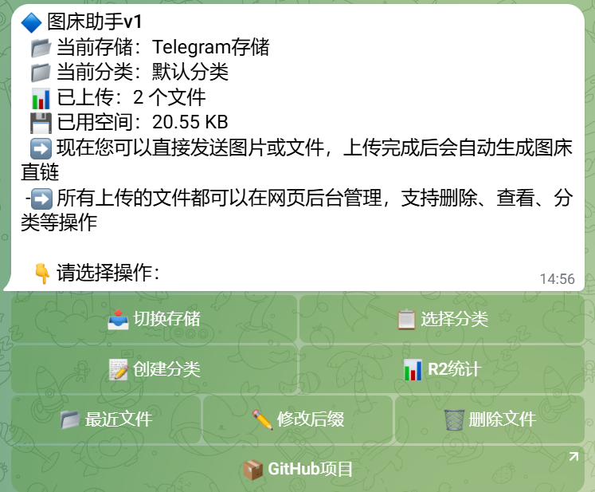

## 📸 截图
| 网页管理               | Telegram 交互            |
|------------------------|--------------------------|
|  |  |

## ✨ 核心特性

- **与 [CTT](https://github.com/iawooo/cftc) 项目协同，实现一举两得**  
  - **提升整体效率**：与  [CTT](https://github.com/iawooo/cftc)  项目无缝协作，共享 Telegram 生态的优势。群组中用户既能享受 CTT 的消息转发功能，又能利用 cftc 的图床服务，最大化 Telegram 群组的价值。

- **Telegram 机器人驱动的智能管理**  
  - **随时随地操作**：内置 Telegram 机器人提供直观的菜单面板，支持上传、修改后缀、管理和分类文件等功能。用户通过简单按钮即可完成复杂操作，无需专业技能，管理文件如同聊天般轻松。

- **永久直链的革命性体验**  
  - **提升用户体验**：通过先删除旧文件、上传新文件并修改直链后缀为旧后缀。用户可以在不更改链接的情况下频繁更新文件内容（如替换照片或文档），特别适合博客、电商或需要稳定链接的场景。

- **Cloudflare workers/pages部署**  
  - **快速上手**：代码简单，部署代码，填写变量便能使用。
  - **免费永久稳定的图床服务**  Cloudflare 的业界领先稳定性，一旦部署，文件托管长期可靠，无需担心服务中断或数据丢失，一劳永逸，节省维护精力。

- **Cloudflare D1 数据库**  
  - **高效存储**：使用Cloudflare D1这个根本用不完的数据库存储用户设置和文件元数据，避免用kv这个少得可怜还造成动不动扣费的现象。

- **利用 Telegram 群组的无限免费存储**  
  - **零成本存储**：利用 Telegram 群组作为免费存储后端，空间近乎无限，成本为零。用户无需额外付费即可托管图片、视频和文档，轻松实现高性价比的图床。   

- **灵活的双存储模式**  
  - **灵活适配，覆盖广泛**：支持 Telegram 存储和 Cloudflare R2 存储两种模式，用户可根据需求自由切换。Telegram 模式适合轻量文件，R2 模式支持大文件和高性能，满足从个人分享到企业托管的多种场景。  

- **动态直链后缀修改**  
  - **直链可复用**：cftc 允许用户随时修改文件直链的后缀，无需更改文件内容即可生成新链接。改变了传统图床“修改内容必须更换直链”的限制，实现动态化管理。  
 
## ✨ 核心功能

cftc 提供了以下强大的功能，满足从个人用户到开发者的多种需求：

- **Telegram 机器人交互**  
  - 通过 Telegram 机器人直接上传图片、视频、音频或文档等文件，实时获取直链。
  - 支持 `/start` 命令打开交互菜单，轻松管理文件和设置。
  - 提供分类创建、存储切换和文件后缀修改等功能，操作简单直观。
  - **使用场景**：快速分享照片给朋友、在群组中分发文件，或为博客生成图片链接。

- **双存储支持**  
  - **Telegram 存储**：利用 Telegram 的内置文件存储，适合轻量级用户，无需额外配置。
  - **Cloudflare R2**：支持大文件和高并发访问，享受 Cloudflare 的全球 CDN 加速。
  - **动态切换**：用户可通过 Telegram 或网页界面随时切换存储类型。
  - **使用场景**：小文件用 Telegram 存储节省成本，大文件用 R2 确保性能。

- **强大的文件管理**  
  - 网页管理面板支持文件预览、分类、搜索和批量操作。
  - 支持创建和删除分类，所有文件可按类别组织，便于管理。
  - 允许修改文件后缀，生成自定义直链，提升品牌一致性。
  - **使用场景**：整理项目资源、归档团队文件或管理个人媒体库。

- **安全与认证**  
  - 可选的用户名/密码认证，保护管理界面免受未经授权的访问。
  - 使用 HTTP-only 和 Secure Cookie，确保登录会话安全。
  - **使用场景**：为私有项目设置访问限制，或保护敏感文件。

- **二维码分享**  
  - 每上传一个文件，自动生成二维码，便于移动设备扫描和访问。
  - 支持网页和 Telegram 分享链接，简化分发流程。
  - **使用场景**：快速分享活动海报、会议资料或社交媒体内容。

- **多格式兼容**  
  - 支持图片（JPG、PNG、GIF 等）、视频（MP4、WebM）、音频（MP3、WAV）和文档（PDF、DOCX 等）。
  - 自动识别文件类型并优化显示（例如图片预览、视频播放）。
  - **使用场景**：上传设计稿、演示视频或技术文档，满足多样化需求。

- **性能优化**  
  - 内置文件缓存、菜单缓存和按钮缓存，减少 API 请求，提升响应速度。
  - 利用 Cloudflare Workers 的无服务器架构，全球低延迟访问。
  - **使用场景**：为高流量网站提供可靠的图片托管服务。

## 部署教程
#### 准备工作
1. **创建Telegram Bot**：
   - 在Telegram中找到`@BotFather`，发送`/newbot`创建新机器人。
   - 按照提示设置机器人名称和用户名，获取Bot Token（例如`123456:ABC-DEF1234ghIkl-zyx57W2v1u123ew11`）。

2. **创建后台群组**：
   - 创建一个Telegram群组（按需设置是否公开），
   - 添加机器人为管理员。
   - 获取群组的Chat ID（例如`-100123456789`），可以通过`@getidsbot`获取（拉它进群）。
   - 
#### 创建D1 SQL数据库
1. 登录[Cloudflare仪表板](https://dash.cloudflare.com/)。
2. 导航到 **存储和数据库 > D1 SQL数据库**，输入一个名称（例如`cftc`），点击 **创建**。

#### 创建R2存储桶

### 部署到Cloudflare pages (推荐)
### *点个star，frok本项目** 
#### 创建pages项目
1. 登录[Cloudflare仪表板](https://dash.cloudflare.com/)。
2. 导航到 **Workers和Pages > Workers和Pages**，点击 **创建**。
3. 点击 **Pages**，再点击 **连接到Git** 
4. 选择 **cftc** 存储库，点击**开始设置**，输入项目名称（例如`cftc`）
5. 点击 **保存并部署**，等待20秒左右，点击 **继续处理项目**
6. 点击**设置**，根据变量表添加或绑定变量，确保变量正确。
7. 点击**部署**，找到**重试部署**，点击**重试部署**

### 部署到Cloudflare Workers 
## 🛠️ 使用说明

*   **网页界面**:
    *   访问 Worker 的 URL (例如 `https://your-worker.workers.dev/` 或你的自定义域名)。
    *   如果启用了认证，需要先在 `/login` 页面登录。
    *   `/upload`: 文件上传页面，可选择分类和存储后端。
    *   `/admin`: 文件管理后台，可查看、搜索、筛选、分享、删除文件和管理分类。
*   **Telegram Bot**:
    *   向你的 Bot 发送 `/start` 开始交互。
    *   直接发送图片、视频、文档等文件给 Bot 进行上传。
    *   使用 Bot 提供的内联键盘按钮进行各种操作（切换存储、管理分类、查看文件、修改后缀、删除文件等）。
    *   按照 Bot 的提示回复消息以完成特定操作（如输入新分类名称、要删除的文件名、新后缀等）。

以下是项目中需要在 Cloudflare 环境中绑定的变量及其说明：

| **变量名**                  | **类型**   | **描述**                                                                 | **默认值/示例**            |
|-----------------------------|------------|--------------------------------------------------------------------------|----------------------------|
| `DATABASE`                 | D1 绑定    | **(必需)** Cloudflare D1 数据库绑定名称，用于存储文件元数据、用户设置和分类信息。   | `cftc-db`             |
| `DOMAIN`                   | 环境变量   | **(必需)** Cloudflare Workers/pages 部署域名，用于生成文件直链和设置 Telegram Webhook。    | `yourdomain.workers/pages.dev`   |
| `TG_BOT_TOKEN`             | 环境变量   | **(必需)** Telegram 机器人 Token，用于与 Telegram API 通信以处理文件上传和交互。    | `123456:ABC-DEF1234ghIkl` |
| `TG_STORAGE_CHAT_ID`       | 环境变量   | **(必需，如果使用 Telegram 存储)** 用于存储文件的 Telegram 群组或频道 ID。           | `-100123456789`            |
| `USERNAME`                 | 环境变量   | **(必需，如果 `ENABLE_AUTH` 为 `true`)** 管理面板的登录用户名。                          | `admin`                    |
| `PASSWORD`                 | 环境变量   | **(必需，如果 `ENABLE_AUTH` 为 `true`)** 管理面板的登录密码。                            | `your_secure_password`     |
| `MAX_SIZE_MB`              | 环境变量   | **(可选)** 单个文件的最大大小限制（单位 MB），防止上传过大文件。                    | `20`                       |
| `BUCKET`                   | R2 绑定    | **(可选)** Cloudflare R2 存储桶绑定名称，用于 R2 存储模式（若启用）。               | `cftc-bucket`         |
| `COOKIE`                   | 环境变量   | **(可选)** 网页认证 Cookie 的有效期（单位天），控制登录会话时长。                   | `7`                        |
| `TG_CHAT_ID`               | 环境变量   | **(可选)** 允许使用机器人的 Telegram 用户（英文逗号分隔），限制访问权限。      | `123456789,987654321`     |
| `ENABLE_AUTH`              | 环境变量   | **(可选)** 是否启用网页管理界面的用户名/密码认证（`true` 或 `false`）。             | `true`                     |

## 🧩 技术栈

- **Cloudflare Workers/pages**：高性能无服务器运行时，支持全球部署。
- **Cloudflare D1**：SQLite 数据库，存储文件元数据和用户设置。
- **Cloudflare R2**：对象存储，替代传统文件托管服务。
- **Telegram Bot API**：实现实时文件上传和交互。
- **JavaScript (ES Modules)**：核心逻辑，异步处理请求。

## 🤝 贡献
### 欢迎为 cftc 贡献代码或建议！

## 🌟 致谢
### Cloudflare - 提供强大的基础设施支持。
### Telegram - 便捷的 Bot API。
### 感谢所有测试者、贡献者和社区支持！

# ⭐ 谢谢您的star

